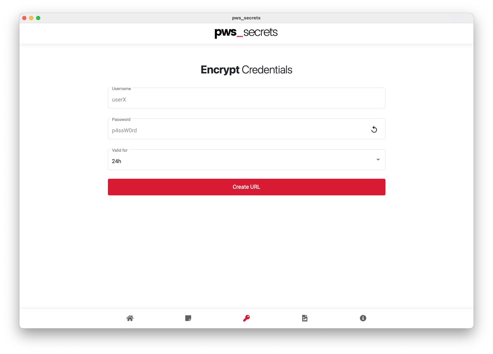

<!-- PROJECT LOGO -->
<br />
<p align="center">
  <a href="https://secrets.pws-agency.com/">
    
  </a>

  <h3 align="center">README</h3>

  <p align="center">
    share a secret note, access data or images via a web link that will self-destruct after it is read by your intended recipient.
    <br />
    <br />
    <a href="https://git.pws-agency.com/pws/secrets.pws-agency.com/-/issues">Report Bug</a>
    ·
    <a href="https://git.pws-agency.com/pws/secrets.pws-agency.com/-/issues">Request Feature</a>
    <br />
    <br />
  </p>
</p>

<!-- TABLE OF CONTENTS -->
<details open="open">
  <summary>Table of Contents</summary>
  <ol>
  <li><a href="#about-the-project">About The Project</a><ul><li><a href="#built-with">Built With</a></li></ul></li>
  <li><a href="#getting-started">Getting Started</a><ul><li><a href="#prerequisites">Prerequisites</a></li><li><a href="#installation">Installation and Deployment</a></li></ul></li>
  <li><a href="#download">Download</a></li>
  <li><a href="#faq">FAQ</a></li>
  <li><a href="#roadmap">Roadmap</a></li>
  <li><a href="#contributing">Contributing</a></li>
  <li><a href="#license">License</a></li>
  <li><a href="#contact">Contact</a></li>
</ol>
</details>

<!-- ABOUT -->
## About The Project

<p align="center">
  <a href="https://secrets.pws-agency.com/home">
    
  </a>
</p>

The application pws_secrets is a small django+python project that is open source and published under the [MIT](https://git.pws-agency.com/pws/secrets.pws-agency.com/-/blob/master/LICENSE) license. So you can have a look at the program code on our GitLab server - if you notice any bugs or just like the app, we'd love to hear from you!

We've also created an app for each OS - you can find out more [here](#Download).

### Built With

- [Python](https://www.python.org)
- [django](https://www.djangoproject.com)

<!-- GETTING STARTED -->
## Getting Started

This is an example of how you may give instructions on setting up your project locally. To get a local copy up and running follow these simple example steps.

### Prerequisites

First you need `python` and `npm` running on your system with:

  ```
  brew install python3
  brew install node
  ```

### Installation and Deployment

#### Backend

To install the django and Python requirements, you should create a virtual environment. Usage:

  ```
  cd backend/
  python3 -m venv venv
  source venv/bin/activate
  pip install -r requirements.txt
  ```

Create a secrets file for encryption und backend/secrets.json:

  ```
  {
    "SECRET_KEY": "dsfklsfkldslkdklfsdkfdEXAMPLE",
    "ENCRYPTION_KEY": "Disdfjijkldsnksld=EXAMPLE"
  }
  ```

To start a test server, use this command (activate the venv first):

  ```
  ./manage.py testserver 8000
  ---- OR ----
  venv/bin/python3 manage.py runserver 8000
  ```

#### Frontend

  First, you have to install all requirements:

  ```
  sudo npm install -g @angular/cli
  cd frontend/
  npm install
  ```

  To compile the Angular project in a development environment, you should use the following command:

  ```
   npm run dev
  ```

  If you want to compile the productive Angular files:

  ```
   npm run prodbuild
  ```

<!-- APP -->
## Download

We have built a app with [nativefier](https://github.com/nativefier/nativefier) for each OS. You can download it here:

- [macOS](https://git.pws-agency.com/pws/secrets.pws-agency.com/-/blob/master/downloads/macOS)
- [Windows](https://git.pws-agency.com/pws/secrets.pws-agency.com/-/blob/master/downloads/Windows)
- [Linux](https://git.pws-agency.com/pws/secrets.pws-agency.com/-/blob/master/downloads/Linux)

#### Installation macOS

Download the zip file from the directory. Unzip the file in your `Applications/` folder to install the app. Start the app by double clicking on pws_secrets.

#### Installation Windows

Download the zip file from the directory. Unzip the file in a directory you want, for example `Documents/`. Then you can create a shortcut and place it on the desktop. Start the app by double clicking on the shorcut pws_secrets.

#### Installation Linux

Download the zip file from the directory. Unzip the file in a directory you want, for example `/usr/local/bin/`. It is important that the path is present in the $PATH variable so that the program can be called.

<!-- FAQ -->
## FAQ

1. Is pws_secrets really private?

We are confident that pws_secrets is both private and secure, and we are constantly working to make it that way! For more details please read our [privacy policy](https://secrets.pws-agency.com/info).

2. How can I send my note? Is there a way to send the link directly from the website?

pws_secrets gives you a link to your note. You need to copy and paste this link into an email (or instant message) and send it to the person who should read the note.

3. What secrets can I send with pws_secrets?

You have the possibility to send a secret note, access data or pictures via pws_secrets. Use the tabs with the icons at the bottom of the page to choose one of the functions.

4. Can I send a secret to multiple recipients?

No, currently a secret message can only be opened once and is only valid as long as specified by the creator. A URL is valid for exactly one, two or three days, after which the secret is no longer retrievable.

5. What can I do if I regret sending the note or if I accidentally send it to someone I don't want to read?

You just have to insert the link in the URL of your browser, when the secret is displayed, it will destroy itself. If the person you sent the link to tries to do the same, he will see the message that the secret is expired or invalid.

6. The recipient can copy and paste the note, so it won't really destroy itself, will it?

Correct. But then again, you couldn't prevent the recipient from taking a screenshot or even memorizing the note. Therefore pws_secrets does not try to protect the contents of the message from being copied. It just makes sure that the content is never read by anyone before it reaches the recipient, and it is never read by anyone afterwards. What the recipient does with the secret message is in his own responsibility.

7. Is it possible to see a recently read note about the history of the browser, the back button, or the function of the recently closed tabs?

A secret note destroys itself after reading — there is no way to re-read it after reading it.

8. How much time are unread notes stored on your servers?

Only secret images are stored encrypted on the server for a maximum time period of 3 days, the decryption key isn't on the server, so the image can't be decrypted without the link of the creator.

Secret notes and credentials aren't stored on the server, only a hash value of the secret messages is being saved when it's already opened.

You have another question? Then please send us an email to secrets@pws-agency.com.

<!-- ROADMAP -->
## Roadmap

See the [open issues](https://git.pws-agency.com/pws/secrets.pws-agency.com/-/issues) for a list of proposed features (and known issues).

<!-- CONTRIBUTING -->
## Contributing

Contributions are what make the open source community such an amazing place to be learn, inspire, and create. Any contributions you make are **greatly appreciated**.

1. Fork the Project
2. Create your Feature Branch (`git checkout -b feature/AmazingFeature`)
3. Commit your Changes (`git commit -m 'Add some AmazingFeature'`)
4. Push to the Branch (`git push origin feature/AmazingFeature`)
5. Open a Pull Request

<!-- LICENSE -->
## License

Distributed under the [MIT](https://git.pws-agency.com/pws/secrets.pws-agency.com/-/blob/master/LICENSE) License. See `LICENSE` for more information.

<!-- CONTACT -->
## Contact

pws_agency - secrets@pws-agency.com
